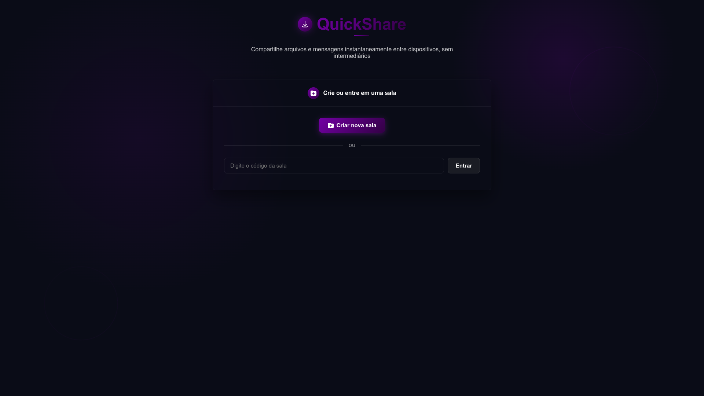
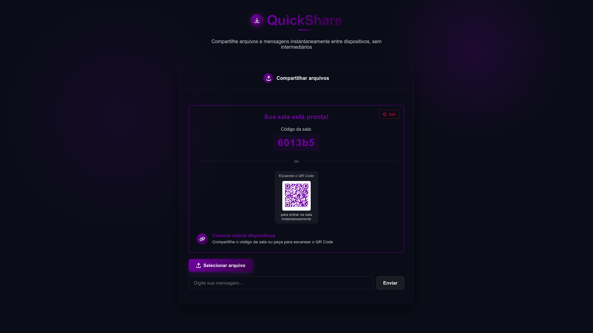
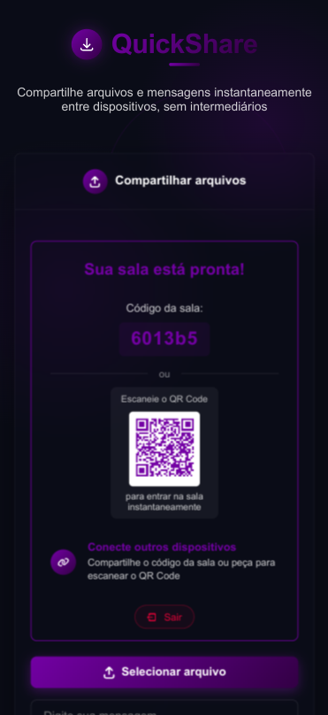

<div align="center">
  <div style="display: flex; justify-content: center; align-items: center; margin-bottom: 20px;">
    <div style="background: linear-gradient(135deg, #6441a5, #2a0845); width: 40px; height: 40px; border-radius: 50%; display: flex; align-items: center; justify-content: center; margin-right: 12px; box-shadow: 0 0 20px rgba(129, 93, 197, 0.36);">
      <svg xmlns="http://www.w3.org/2000/svg" viewBox="0 0 24 24" width="20" height="20" fill="white">
        <path d="M11 14.59V3a1 1 0 0 1 2 0v11.59l3.3-3.3a1 1 0 0 1 1.4 1.42l-5 5a1 1 0 0 1-1.4 0l-5-5a1 1 0 0 1 1.4-1.42l3.3 3.3zM3 17a1 1 0 0 0-1 1v.5A3.5 3.5 0 0 0 5.5 22h13a3.5 3.5 0 0 0 3.5-3.5V18a1 1 0 0 0-2 0v.5a1.5 1.5 0 0 1-1.5 1.5h-13A1.5 1.5 0 0 1 4 18.5V18a1 1 0 0 0-1-1z"/>
      </svg>
    </div>
    <h1 style="font-size: 2.8rem; font-weight: 800; background: linear-gradient(135deg, #6441a5, #2a0845); -webkit-background-clip: text; -webkit-text-fill-color: transparent; background-clip: text; color: transparent; margin: 0; border: none; padding-bottom: 0;">QuickShare</h1>
  </div>

  <p><em>Compartilhamento de arquivos e comunicação em tempo real em segundos</em></p>

  <p>
    
    
    
  </p>
</div>

## 📝 Visão Geral

**QuickShare** é uma aplicação web ultrarrápida projetada para compartilhamento de arquivos e comunicação em tempo real. Crie uma sala instantaneamente, compartilhe o código ou QR Code, e comece a transferir arquivos e mensagens entre dispositivos sem necessidade de criar contas.

## ✨ Funcionalidades

- **💬 Chat em Tempo Real**: Mensagens instantâneas entre dispositivos conectados
- **📁 Compartilhamento de Arquivos**: Upload de arquivos e acompanhamento visual do progresso
- **🔄 Suporte WebRTC**: Conexões peer-to-peer para transferências mais rápidas quando possível
- **📱 Design Responsivo**: Experiência otimizada para desktop e dispositivos móveis
- **🔐 Sessões Temporárias**: Sem contas ou armazenamento permanente de dados
- **⏱️ Expiração Automática**: Arquivos são automaticamente removidos após 7 dias
- **📷 Acesso por QR Code**: Escaneie para entrar em salas a partir de dispositivos móveis
- **⚡ Baixa Latência**: Atraso mínimo para mensagens e transferências de arquivos
- **🏠 Persistência de Sala**: Os dados da sessão persistem entre atualizações de página

## 🖥️ Capturas de Tela

<div align="center">
  
  <p><em>Tela Inicial Desktop</em></p>
  
  <p><em>Criar Sala Desktop</em></p>
  
  <br>
  
  <div style="display: flex; justify-content: space-around;">
    
    
  </div>
  <p><em>Experiência Mobile</em></p>
</div>

## 🔧 Stacks

- **Frontend**: HTML5, CSS3, JavaScript (ES6+)
- **Backend**: Node.js com Express
- **Comunicação em Tempo Real**: Socket.IO
- **Peer-to-Peer**: WebRTC para conexões diretas entre dispositivos
- **Componentes UI**: CSS personalizado com princípios de design responsivo
- **Notificações**: SweetAlert2 para feedback do usuário

## 🚀 Começando

### Pré-requisitos

- Node.js (v14.0.0 ou superior)
- npm (v6.0.0 ou superior)

### Instalação

1. Clone o repositório

   ```bash
   git clone https://github.com/zerotohero3/quickshare.git
   cd quickshare
   ```

2. Instale as dependências

   ```bash
   npm install
   ```

3. Inicie o servidor de desenvolvimento

   ```bash
   npm start
   ```

4. Abra seu navegador e acesse `http://localhost:3000`

## 🌟 Guia de Uso

### Criando uma Sala

1. Visite a página inicial do QuickShare
2. Clique em "Criar nova sala"
3. Compartilhe o código da sala gerado ou o QR Code com outras pessoas

### Entrando em uma Sala

1. Digite o código da sala no campo de entrada
2. Ou escaneie o QR Code usando um dispositivo móvel
3. Clique em "Entrar"

### Compartilhando Arquivos

1. Clique em "Selecionar arquivo"
2. Os arquivos serão automaticamente enviados e disponibilizados para todos os participantes da sala
3. Acompanhe o progresso com a barra de progresso visual

### Conversando

1. Digite sua mensagem no campo de entrada
2. Pressione Enter ou clique no botão enviar
3. Todos os participantes receberão sua mensagem em tempo real

## ⚙️ Detalhes Técnicos

### Backend

- Servidor Node.js com Express para gerenciamento de requisições HTTP
- Socket.IO para comunicação em tempo real entre clientes
- Gerenciamento de salas com expiração automática após 48 horas de inatividade
- Armazenamento temporário de arquivos para compartilhamento
- Limpeza automática de arquivos expirados (realizadas a cada 60 minutos)

### Frontend

- Design responsivo para funcionar em desktop e dispositivos móveis
- Interface de usuário intuitiva com feedback visual para ações
- Suporte a WebRTC para conexões peer-to-peer quando possível
- Geração de QR Codes para acesso fácil via dispositivos móveis

## 📜 Licença

Este projeto está licenciado sob a Licença MIT - veja o arquivo [LICENSE](LICENSE) para detalhes.

---

<div align="center">
  <p>Feito com ❤️ por Victor Hugo</p>
  <p>
    <a href="https://github.com/zerotohero3">GitHub</a> •
    <a href="https://www.linkedin.com/in/vhsoftdev">LinkedIn</a>
  </p>
</div>
